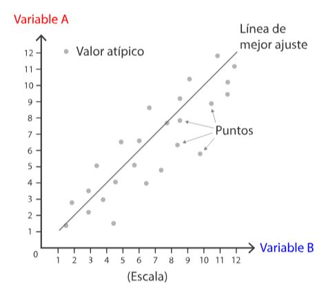
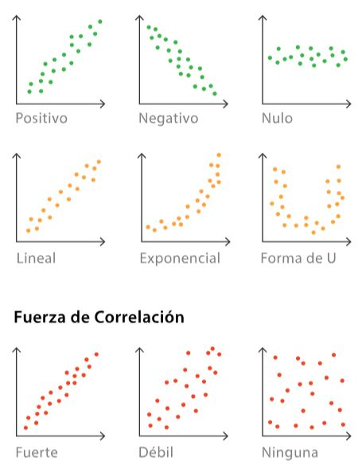

# Visualización 1 - Diagrama de dispersión o scatterplot

- [1. Definición de la técnica de visualización utilizada](#Definición-de-la-técnica-de-visualizacion)
- [2. Descripción de los datos utilizados](#Descripción-de-los-datos-utilizados)
- [3. Detalle de la visualización realizada](#Detalle-de-la-visualización-realizada)

---

## 🔹 Definición de la técnica de visualización utilizada
Diagrama de dispersión o scatterplot, es un tipo de visualización de datos en el que se representa dos variables distintas. En el eje horizontal (eje X) representa los valores de una variable, denominada variable independiente. El eje vertical (eje Y) representa los valores de la otra variable, conocida como variable dependiente.

Con este tipo de representación podemos analizar la relación que existen entre las variables. Esta puede ser:
- Positiva: Los valores aumentan juntos
- Negativa: Un valor disminuye a medida que el otro aumenta
- Nulo (sin correlación): No existe relación clara
- Lineal
- Exponencial
- En forma de U

**Origen** - No se puede decir que un solo autor inventó este gráfico, pero sin duda hay que mencionar a Sir John Frederick W. Herschel (Reino Unido, 1792 - 1871) y Sir Francis Galton (Reino Unido, 1822 - 1911). Sus investigaciones en astronomía y genética fueron clave para que llegáramos al gráfico de dispersión tal como lo usamos hoy.

**¿Cuándo usar diagramas de dispersión?**
- Para identificar si existe una relación entre dos variables (tendencias, patrones...)
- Para identificar si los datos se agrupan en patrones o los datos son dispersos.
- Para identificar outliers, estos serán los que se encuentren mas alejados de un grupo de datos.

**Ejemplos de aplicación** - Los diagramas de dispersión son herramientas muy utiles para visualizar la relación entre dos variables. Como por ejemplo:
- *Relación entre el consumo de calorías y la actividad física:* En analisis de nutrición se puede usar un diagrama de dispersión para ver si existe alguna relación entre el consumo de calorías y el nivel de actividad física de una persona.
- *Relación entre horas de sueño y notas académicas:* En analisis académicos se puede usar un diagrama de dispersión para ver si existe alguna relación entre las horas de sueño y las notas de un alumno.

## 🔸 Descripción de los datos utilizados
#### Los datos utilizados ¿Son cuantitativos o cualitativos?

Los gráficos de dispersión se utilizan para identificar patrones, tendencias y posibles correlaciones entre las variables que se analizan. Por tanto, los mejores datos para un diagrama de dispersión son aquellos donde tienes dos variables numéricas (cuantitativas) que deseas comparar o analizar en términos de su relación o correlación.

#### ¿Qué estructura tienen que tener los datos para esta técnica?

Como se ha comentado anteriormente, en los diagramas de dispoersión se representan datos de dos variables. Una variable se representa en el eje horozontal X y la otra variable se representa en el eje vertical Y. Por tanto los datos deben ser cuantitativos y tener una relación de contexto, es decir, por ejemplo si se quiere representar que relación puede existir entre las variables edad y altura es necesario que los datos de ambas variables sean tomados de las mismas personas.

#### ¿Existe alguna limitación en los datos para esta técnica? 
Existesn varias limitantes en los datos, por su tipologia o relación entre ellos, a la hora de representar con diagramas de dispoersión. 

Una limitación que hemos visto con anterioridad es la falta de relación entre las variables a analizar. Por tanto para este tipo de visualización es necesario tener o sospechar que existe una relación entre ambas variables.

Otra limitación es el uso de este tipo de visualización con datos categoricos (pais, color, género...) ya que no se pueden representar este tipo de datos en un espacio bidimensional. Para la representación de datos categoricos es recoemndable el uso de otros tipos de visualizaciones como diagramas de barras, gráficos de cajas...

#### ¿hay medida mínima y máxima del juego de datos para esta técnica?

Para este tipo de visualización sí existe medida mínima y máxima de los datos:
- Medida mínima --> Al menos se necesitarán 2 puntos, aunque no se podrá obtener mucha información sobre la relación entre las dos variables. Se podrá estimar una tendencia aunque estará lejos de un analisis con tendencia más real conseguida con más datos.
  
- Medida máxima --> Aunque los diagramas de dispersión pueden manejar gran cantidad de datos, se debe realizar una buena limpieza de los datos y realiar un buen uso del los colores para que no sea dificil la interpretación.

## ◾ Detalle de la visualización realizada
#### Visualización 1 - Diagrama de dispersión o scatterplot

Pasos del análisis de datos:

1. Elección de conjunto de datos
2. Análisis de los datos
3. Importación de los datos
4. Preparación de los datos
5. Visualización de los datos

Para crear el diagrama de dispersión o scatterplot se ha seguido el siguiente proceso:

- *Elección de conjunto de datos* - El conjunto de datos elegido es [Red Wine Quality](https://www.kaggle.com/datasets/uciml/red-wine-quality-cortez-et-al-2009) de la plataforma Kaggle.
- *Análisis de los datos* - Se revisan los datos elegidos cuyas variables elegidas para la visualización son ph y quality, de todas las que se muestran a continuación:
  
   Input variables (based on physicochemical tests):
    - fixed acidity
    - volatile acidity
    - citric acid
    - residual sugar
    - chlorides
    - free sulfur dioxide
    - total sulfur dioxide
    - density
    - pH
    - sulphates
    - alcohol
      
  Output variable (based on sensory data):
    - quality (score between 0 and 10)
      
- *Importación de datos* - La herramienta elegida para esta visualización es LookerStudio, donde se ha importado el conjunto de datos por csv
- *Preparación de los datos* - En este caso, para esta visualización, no ha hecho falta realzar ninguna transformación en los datos.
- *Visualización de los datos* - A continuación se muestra la representación de las variables ph y quality del conjunto de datos escogido con el digrama de dispersión.

  

*Nota: Hacer click en la imagen*

Cuestiones relevantes acerca de la visualización mostrada:
- ¿Qué tipos de datos se utiliza?

  Como hemos visto anteriormente, los diagramas de dispersión son idelaes cuando se tienen datos numéricos y se desea saber si existe una relación directa entre ellos. En este caso las variables a tratar son ph y quality.

  ph --> datos de tipo decimal.

  quality --> datos de tipo entero.
  
- ¿Qué se pretende comunicar o descubrir con la visualización? ¿Ayuda la técnica a lograrlo?

  El diagrama de dispersión muestra la relación que existe entre el ph de vinos rojos Portugueses y su calidad. Como se puede observar existe una relación positiva ya que a medida que los valores de una variable aumenta, los valores de la otra variable también tienden a aumentar.
  
---

**[Volver a Página de Inicio](../index.md)**
