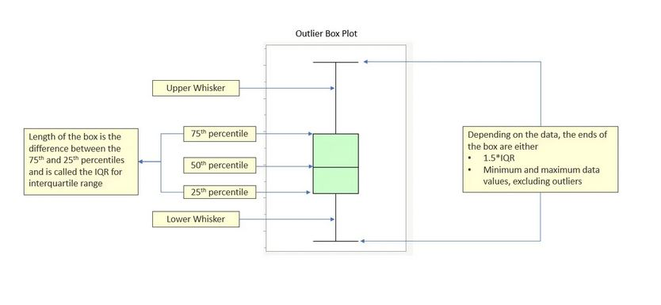
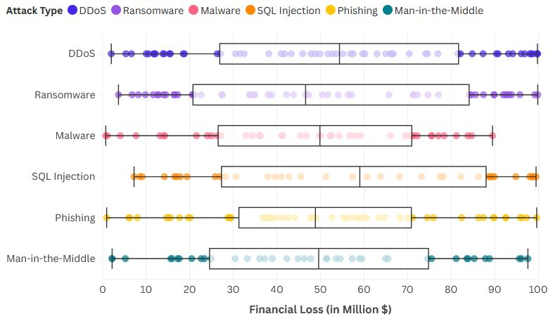

# Visualización 2 - Box plot

- [1. Definición de la técnica de visualización utilizada](#Definición-de-la-técnica-de-visualizacion-utilizada)
- [2. Descripción de los datos utilizados](#Descripción-de-los-datos-utilizados)
- [3. Explicación de la visualización](#Explicación-de-la-visualización)

---

## ℹ️ Definición de la técnica de visualización utilizada 
##### Tipo de visualización
Los diagramas de caja o Box Plot muestran la distribución de datos para una variable cuantitativa.

El box plot se utiliza para mostrar estadísticas descriptivas de datos cuantitativos como:
- Mediana (la línea dentro de la caja).
- Rango intercuartílico (IQR) (la caja entre el primer cuartil y el tercer cuartil).
- Valores atípicos (los puntos fuera de los bigotes).
- Mínimo y máximo (los extremos de los bigotes).

**Origen** - QUITAR- No se puede decir que un solo autor inventó este gráfico, pero sin duda hay que mencionar a Sir John Frederick W. Herschel (Reino Unido, 1792 - 1871) y Sir Francis Galton (Reino Unido, 1822 - 1911). Sus investigaciones en astronomía y genética fueron clave para que llegáramos al gráfico de dispersión tal como lo usamos hoy.

**¿Cuándo usar diagramas Box Plot?**
- Para comparar varias categorías o grupos.
- Para ver la distribución de una sola variable.
- Para identificar si los datos se agrupan en patrones o los datos son dispersos.
- Para identificar outliers, estos serán los que se encuentren mas alejados de la mediana y cuartiles.
  
**Ejemplos de aplicación** - Los diagramas Box Plot son herramientas muy utiles ver la distribución de una sola variable y comparar grupos o categorías . Como por ejemplo:
- *¿Cómo varían los salarios en diferentes departamentos?* Se podria analizar la distribución de los salarios en cada uno de los departamentos. Por ejemplo: La distribución de los salarios en el dept. RRHH y ña distribución de salarios en el dept. IT

## 📥 Descripción de los datos utilizados 
#### Los datos utilizados ¿Son cuantitativos o cualitativos?

Los gráficos de dispersión se utilizan para identificar patrones, tendencias y posibles correlaciones entre las variables que se analizan. Por tanto, los mejores datos para un diagrama de dispersión son aquellos donde tienes dos variables numéricas (cuantitativas) que deseas comparar o analizar en términos de su relación o correlación.

#### ¿Qué estructura tienen que tener los datos para esta técnica?

Como se ha comentado anteriormente, en los diagramas de dispoersión se representan datos de dos variables. Una variable se representa en el eje horozontal X y la otra variable se representa en el eje vertical Y. Por tanto los datos deben ser cuantitativos y tener una relación de contexto, es decir, por ejemplo si se quiere representar que relación puede existir entre las variables edad y altura es necesario que los datos de ambas variables sean tomados de las mismas personas.

#### ¿Existe alguna limitación en los datos para esta técnica? 

Algunas limitaciones en los datos para el diagrama Box plot:
- Uso de este tipo de visualización con datos categoricos (pais, color, género...) ya que no se pueden representar este tipo de datos en un espacio bidimensional. Para la representación de datos categoricos es recomendable el uso de otros tipos de visualizaciones como diagramas de barras, gráficos de cajas...
- Con la existencia de muchos outliers, el gráfico puede no ser representativo de la mayoría de los datos y la interpretación de los resultados puede ser errónea.
- Uso de gran volúmenes de datos, el box plot es eficaz para conjuntos de datos pequeños.

En nuestro caso no vemos ninguna de las limitaciones mencionadas en nuestro conjunto de datos.

#### ¿Hay medida mínima y máxima del juego de datos para esta técnica?

Para este tipo de visualización sí existe medida mínima y máxima de los datos:
- Medida mínima --> Al menos se necesitarán 2 puntos, aunque no se podrá obtener mucha información sobre la relación entre las dos variables. Se podrá estimar una tendencia aunque estará lejos de un analisis con tendencia más real conseguida con más datos.
  
- Medida máxima --> Aunque los diagramas de dispersión pueden manejar gran cantidad de datos, se debe realizar una buena limpieza de los datos y realiar un buen uso del los colores para que no sea dificil la interpretación.
  
## 📈 Detalle de la visualización realizada 
#### Visualización 2 - Box Plot

Pasos del análisis de datos:

1. Elección de conjunto de datos
2. Análisis de los datos
3. Importación de los datos
4. Preparación de los datos
5. Visualización de los datos

Para crear el diagrama de dispersión o scatterplot se ha seguido el siguiente proceso:

- *Elección de conjunto de datos* - El conjunto de datos elegido es [Global Cybersecurity Threats 2015-2024](https://www.kaggle.com/datasets/atharvasoundankar/global-cybersecurity-threats-2015-2024) de la plataforma Kaggle.
- *Análisis de los datos* - Se revisan las variables del conjunto de datos elegido:

    - Country
    - Year
    - Attack Type
    - Target Industry
    - Financial Loss (in Million $)
    - Number of Affected Users
    - Attack Source
    - Security Vulnerability Type
    - Defense Mechanism Used
    - Incident Resolution Time (in Hours)

- *Importación de datos* - La herramienta elegida para esta visualización es [Flourish](https://flourish.studio/), donde se ha importado el conjunto de datos por csv
- *Preparación de los datos* - Para esta visualización, unicamente hemos filtrado los datos del Country USA, para comprar por cada tipo de ataque cuantos Millones supuso dicho ataque en USA
- *Visualización de los datos* - A continuación se muestra la representación de las variables ph y quality del conjunto de datos escogido con el digrama de dispersión.

 

*Nota: Hacer click en la imagen*

Cuestiones relevantes acerca de la visualización mostrada:
- ¿Qué tipos de datos se utiliza?

  Las variables utilizadas en esta visualización han sido:

  - Financial Loss (in Millions $) --> datos cuantitativo .

  - Attack Type --> datos de tipo cualitativo (string).
  
- ¿Qué se pretende comunicar o descubrir con la visualización? ¿Ayuda la técnica a lograrlo?

  Como hemos visto anteriormente este tipo de representación se utiliza para comparar diferentes categorias, en este caso los tipos de ataques. Esta representación puede contestar varias preguntas como: ¿Qué tipo de ataque es el que más perdidas ha causado en USA desde 2015 a 2024? ¿Cuál el que menos?

  - SQL Injection Media: 59.03
  - DDoS Media: 54.37
  - Malware Media:49.88
  - Man-in-the-Middle Media:49.58
  - Phishing Media:48.84
  - Ransomware Media: 46.59

  El ataque que más perdidas causó en USA desde 2015 a 2024 fue el SQL Injection y el que menos Ransomware.
  Esta representación si ayuda a comprara varios ataques segun diferentes variables. Tambien se podría haber comparado, por ejemplo:
  
  - Número de usuarios afectados (x) con los diferentes ataques (y).
  - Mecanismo de defensa utilizado (y) con el tiempo de resolucion del incidente (x).

---

**[Volver a Página de Inicio](../index.md)**
