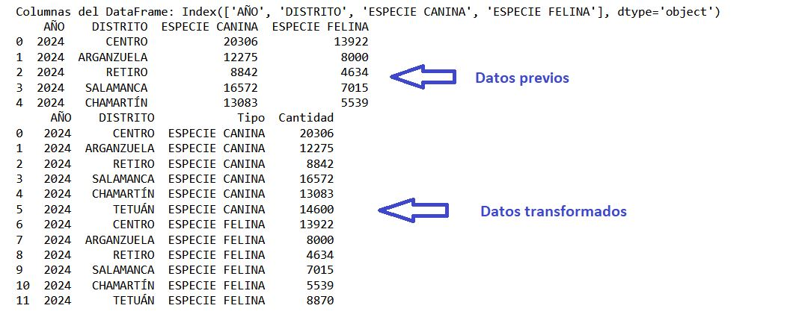
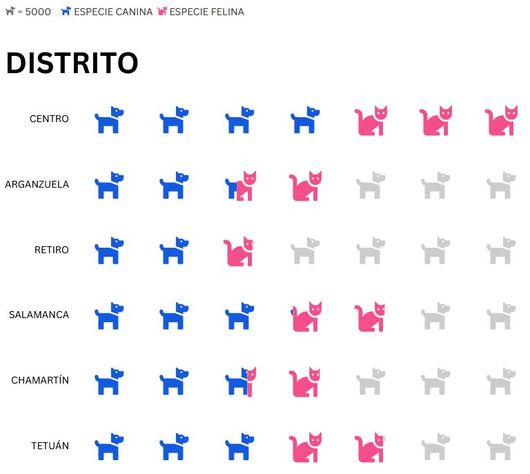

# Visualización 3 - Isotype & Unit charts


- [1. Definición de la técnica de visualización utilizada](#Definición-de-la-técnica-de-visualizacion)
- [2. Descripción de los datos utilizados](#Descripción-de-los-datos-utilizados)
- [3. Detalle de la visualización realizada](#Detalle-de-la-visualización-realizada)

---

## ℹ️ Definición de la técnica de visualización utilizada 
#### Descripción: nombre, origen, funcionamiento, ejemplos de aplicación
##### Tipo de visualización
Isotype charts y Unit charts son visualizaciones que muestran cantidades o valores mediante iconos, unidades, o elementos gráficos representativos, en lugar de usar barras o líneas tradicionales.

A continuación se muestra un ejemplo de un diagrama Isotype, donde se puede ver facilmente la relación de cantidad de personas con respecto a animales en Reino Unido y America.


##### Origen

##### Propósito

##### Ejemplos de aplicación

PONER MAS COSAS, TENDENCIAS, FUNCIONAMIENTO, ORIGEN...

## 📥 Descripción de los datos utilizados 
#### Los datos utilizados ¿Son cuantitativos o cualitativos?

Este tipo de visualización de datos utiliza datos cuantitativos, es ideal para mostrar pocos datos de una manera atractiva y fácil de entender.

- Isotype: Este tipo de repreentación usa íconos para representar cantidades y pueden usar íconos con diferentes representaciones (personas, casas, autos, etc.).

- Unit charts: Este tipo de representación es similar a la anterior pero utiliza bloques, círculos u otros íconos para representar unidades fijas de valor.

#### ¿Qué estructura tienen que tener los datos para esta técnica?

Como se ha visto anteriormente los datos que representan tienen que ser fijos, por tanto deben ser números absolutos o porcentajes. Por ejemplo:

- Isotype: "Hay 300 personas en una ciudad, y cada ícono representa 10 personas".
- Unit chart: "De un total de 100 unidades, 50 están completas".

#### ¿Existe alguna limitación en los datos para esta técnica? 
Este tipo de representación puede resultar muy atrativa y fácil de entender para cantidades pequeñas. Algunas de las limitaciones que encontramos con este tipo de representación:
- Dificultad de entendimiento con grandes conjuntos de datos.
- Dificultad para su uso en relaciones complejas de variables.
- Dificultad de representación en datos que no sean multiplos a los valores establecidos.
No es la mejor representación para conocer los valores exactos, pero si para poder comparar elementos facilmente y poder obtener información rápida. 

#### ¿hay medida mínima y máxima del juego de datos para esta técnica?

Para este tipo de visualización sí existe medida mínima y máxima de los datos:
- Medida mínima --> Dependerá de lo que se quiera representar. Por ejemplo si cada icono representa 10 unidades se necesitará al menos 2-3 íconos para que el gráfico tenga sentido.
  
- Medida máxima --> Como se ha mencionado antes, este tipo de representación funciona bien con cantidades pequeñas para que sea facil de leer y entender

## 📈 Detalle de la visualización realizada 
#### Visualización 3 - Isotype & Unit charts

Pasos del análisis de datos:

1. Elección de conjunto de datos
2. Análisis de los datos
3. Importación de los datos
4. Preparación de los datos
5. Visualización de los datos

Para crear el diagrama Isotype & Unit charts se ha seguido el siguiente proceso:

- *Elección de conjunto de datos* - El conjunto de datos elegido es [Censo de animales domesticos por distrito](https://datos.gob.es/en/catalogo/l01280796-censo-de-animales-domesticos-por-distrito) de Datos Gob España.
- *Análisis de los datos* - Se revisan las variables del conjunto de datos:
  
    - AÑO
    - DISTRITO
    - ESPECIE CANINA
    - ESPECIE FELINA
      
- *Importación de datos* - La herramienta elegida para esta visualización es [Flourish](https://flourish.studio/), donde se ha importado el conjunto de datos por csv
- *Preparación de los datos* - Para esta visualización se ha realizado las siguiente acciones:
  
  - Se han filtrado los datos para representar unicamente los datos de 6 distritos en el año 2024
  - Se ha determinado que cada animal representa 5000 animales
  - Se han transformado los datos para que Flourish pueda interpretarlos correctamente. Con esto conseguiremos configurar dos iconos, uno para perros y otro para gatos.
 
    ```python
      import pandas as pd
      # Cargamos los datos
      df = pd.read_csv(r"C:\Users\María\Downloads\censo_animales_2024.csv")
      # Verificamos las primeras filas y las columnas
      print("Columnas del DataFrame:", df.columns)
      print(df.head())
      # Convertimos a formato largo usando las columnas 'AÑO' y 'DISTRITO' como fijas
      df_long = df.melt(id_vars=["AÑO", "DISTRITO"], var_name="Tipo", value_name="Cantidad")
      # Guardamos el nuevo archivo, este será el archivo que cargaremos en Flourish
      df_long.to_csv("C:/Users/María/Downloads/datos_transformados.csv", index=False)
      # Mostramos el DataFrame transformado
      print(df_long)

Demostración del cambio realizado en los datos:

  
  
- *Visualización de los datos* - A continuación se muestra la representación Isotype del conjunto de datos:

[](https://public.flourish.studio/visualisation/22305448/) 

*Nota: Hacer click en la imagen*


Cuestiones relevantes acerca de la visualización mostrada:
- ¿Qué tipos de datos se utiliza?

  Como hemos visto anteriormente, los diagramas Isotype son idelaes cuando se tienen datos numéricos para poder representarlos con símbolos que equivalen a una cantidad específica.y se desea saber si existe una relación directa entre ellos. En este caso las variables son:

  - Especie canina --> datos de tipo entero.

  - Especie felina --> datos de tipo entero.
  
- ¿Qué se pretende comunicar o descubrir con la visualización? ¿Ayuda la técnica a lograrlo?

  El diagrama Isotype pretende mostrar de forma rápida y simple una comparativa de los datos, sin ser importante el valor concreto del dato. Ante esta premisa este tipo de diagrama ayuda a lograr una facil captación de la comparativa de ambas variables, en este caso numero de gatos y numero de perros en cada distrito.
  
---

**[Volver a Página de Inicio](../index.md)**
