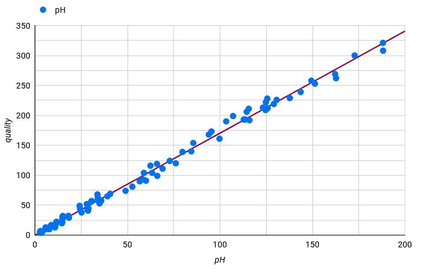

# Visualización 3 - Isotype & Unit charts

- [1. Definición de la técnica de visualización utilizada](#Definición-de-la-técnica-de-visualizacion)
- [2. Descripción de los datos utilizados](#Descripción-de-los-datos-utilizados)
- [3. Detalle de la visualización realizada](#Detalle-de-la-visualización-realizada)

---

## Definición de la técnica de visualización utilizada
#### Descripción: nombre, origen, funcionamiento, ejemplos de aplicación
##### Tipo de visualización
Isotype charts y Unit charts son visualizaciones que muestran cantidades o valores mediante iconos, unidades, o elementos gráficos representativos, en lugar de usar barras o líneas tradicionales.

A continuación se muestra un ejemplo de un diagrama Isotype, donde se puede ver facilmente la relación de cantidad de personas con respecto a animales en Reino Unido y America.

##### Origen

##### Propósito

##### Ejemplos de aplicación

PONER MAS COSAS, TENDENCIAS, FUNCIONAMIENTO, ORIGEN...

## Descripción de los datos utilizados
#### Los datos utilizados ¿Son cuantitativos o cualitativos?

Este tipo de visualización de datos utiliza datos cuantitativos, es ideal para mostrar pocos datos de una manera atractiva y fácil de entender.

- Isotype: Este tipo de repreentación usa íconos para representar cantidades y pueden usar íconos con diferentes representaciones (personas, casas, autos, etc.).

- Unit charts: Este tipo de representación es similar a la anterior pero utiliza bloques, círculos u otros íconos para representar unidades fijas de valor.

#### ¿Qué estructura tienen que tener los datos para esta técnica?

Como se ha visto anteriormente los datos que representan tienen que ser fijos, por tanto deben ser números absolutos o porcentajes. Por ejemplo:

- Isotype: "Hay 300 personas en una ciudad, y cada ícono representa 10 personas".
- Unit chart: "De un total de 100 unidades, 50 están completas".

#### ¿Existe alguna limitación en los datos para esta técnica? 
Este tipo de representación puede resultar muy atrativa y fácil de entender para cantidades pequeñas. Algunas de las limitaciones que encontramos con este tipo de representación:
- Dificultad de entendimiento con grandes conjuntos de datos.
- Dificultad para su uso en relaciones complejas de variables.
- Dificultad de representación en datos que no sean multiplos a los valores establecidos.
No es la mejor representación para conocer los valores exactos, pero si para poder comparar elementos facilmente y poder obtener información rápida. 

#### ¿hay medida mínima y máxima del juego de datos para esta técnica?

Para este tipo de visualización sí existe medida mínima y máxima de los datos:
- Medida mínima --> Dependerá de lo que se quiera representar. Por ejemplo si cada icono representa 10 unidades se necesitará al menos 2-3 íconos para que el gráfico tenga sentido.
  
- Medida máxima --> Como se ha mencionado antes, este tipo de representación funciona bien con cantidades pequeñas para que sea facil de leer y entender

## Detalle de la visualización realizada
#### Visualización 3 - Isotype & Unit charts

Pasos del análisis de datos:

1. Elección de conjunto de datos
2. Análisis de los datos
3. Importación de los datos
4. Preparación de los datos
5. Visualización de los datos

Para crear el diagrama Isotype & Unit charts se ha seguido el siguiente proceso:

- *Elección de conjunto de datos* - El conjunto de datos elegido es [Red Wine Quality](https://www.kaggle.com/datasets/uciml/red-wine-quality-cortez-et-al-2009) de la plataforma Kaggle.
- *Análisis de los datos* - Se revisan los datos elegidos cuyas variables elegidas para la visualización son ph y quality, de todas las que se muestran a continuación:
  
   Input variables (based on physicochemical tests):
    - fixed acidity
    - volatile acidity
    - citric acid
    - residual sugar
    - chlorides
    - free sulfur dioxide
    - total sulfur dioxide
    - density
    - pH
    - sulphates
    - alcohol
  Output variable (based on sensory data):
    - quality (score between 0 and 10) 
- *Importación de datos* - La herramienta elegida para esta visualización es LookerStudio, donde se ha importado el conjunto de datos por csv
- *Preparación de los datos* - En este caso, para esta visualización, no ha hecho falta realzar ninguna transformación en los datos.
- *Visualización de los datos* - A continuación se muestra la representación de las variables ph y quality del conjunto de datos escogido con el digrama de dispersión.

 

*Nota: Hacer click en la imagen*

Cuestiones relevantes acerca de la visualización mostrada:
- ¿Qué tipos de datos se utiliza?

  Como hemos visto anteriormente, los diagramas de dispersión son idelaes cuando se tienen datos numéricos y se desea saber si existe una relación directa entre ellos. En este caso las variables a tratar son ph y quality.

  ph --> datos de tipo decimal.

  quality --> datos de tipo entero.
  
- ¿Qué se pretende comunicar o descubrir con la visualización? ¿Ayuda la técnica a lograrlo?

  El diagrama de dispersión muestra la relación que existe entre el ph de vinos rojos Portugueses y su calidad. Como se puede observar existe una relación positiva ya que a medida que los valores de una variable aumenta, los valores de la otra variable también tienden a aumentar.
  
---

**[Volver a Página de Inicio](../index.md)**
